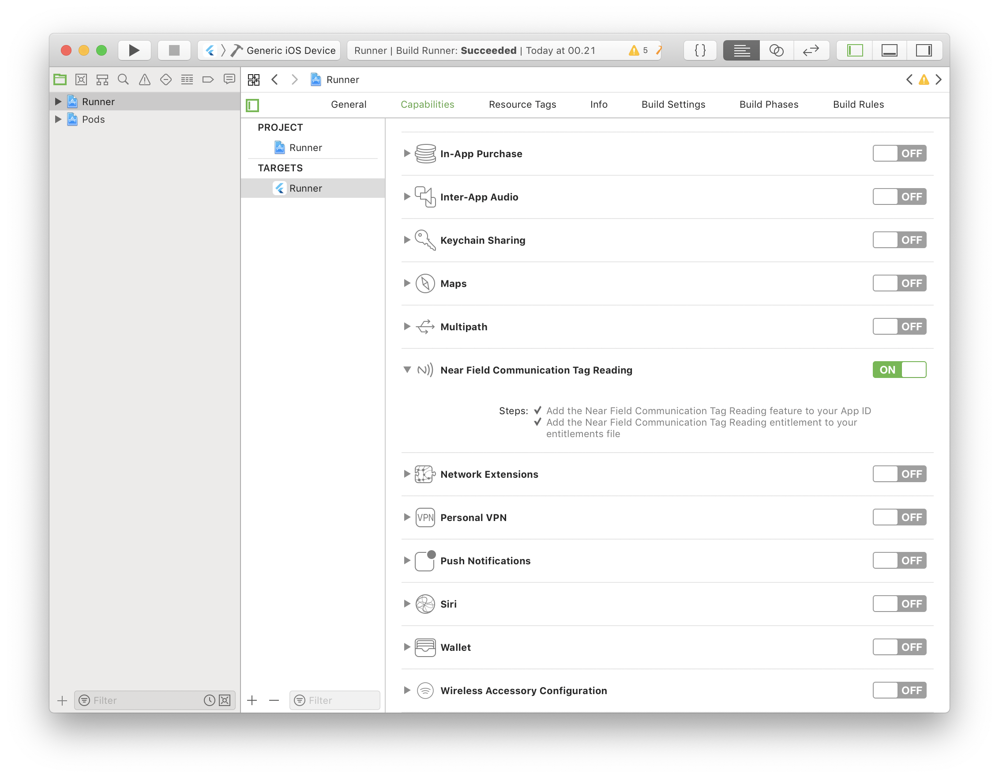

# nfc_in_flutter

NFC in Flutter is a plugin for reading NFC tags in Flutter. It works on both Android and iOS with a simple stream interface.

⚠️ Currently only NDEF formatted tags are supported.

## Usage

### Read NFC tags

```dart
// NFC.readNDEF returns a stream of NDEFMessage
Stream<NDEFMessage> stream = NFC.readNDEF()

stream.listen((NDEFMessage message) {
    print("records: ${message.records.length}");
});
```

### Read one NFC tag

```dart
NDEFMessage message = await NFC.readNDEF(once: true).first;
print("payload: ${message.payload}");
// once: true` only scans one tag!
```

## Example

```dart
import 'package:nfc_in_flutter/nfc_in_flutter.dart';

class NFCReader extends StatefulWidget {
    @override
    _NFCReaderState createState() => _NFCReaderState();
}

class _NFCReaderState extends State {
    bool _supportsNFC = false;
    bool _reading = false;
    StreamSubscription<NDEFMessage> _stream;

    @override
    void initState() {
        super.initState();
        // Check if the device supports NFC reading
        NFC.supportsNDEFReading()
            .then((bool isSupported) {
                setState(() {
                    _supportsNFC = isSupported;
                });
            });
    }

    @override
    Widget build(BuildContext context) {
        if (!_supportsNFC) {
            return RaisedButton(
                child: const Text("You device does not support NFC"),
                onPressed: null,
            );
        }

        return RaisedButton(
            child: Text(_reading ? "Stop reading" : "Start reading"),
            onPressed: () {
                if (_reading) {
                    _stream?.cancel();
                    setState(() {
                        _reading = false;
                    });
                } else {
                    setState(() {
                        _reading = true;
                        // Start reading using NFC.readNDEF()
                        _stream = NFC.readNDEF(
                            once: true,
                            throwOnUserCancel: false,
                        ).listen((NDEFMessage message) {
                            print("read NDEF message: ${message.payload}"),
                        }, onError: (e) {
                            // Check error handling guide below
                        });
                    });
                }
            }
        );
    }
}
```

Full example in [example directory](https://github.com/semlette/nfc_in_flutter/tree/master/example)

## Installation

Add `nfc_in_flutter` to your `pubspec.yaml`

```yaml
dependencies:
  nfc_in_flutter: ^1.2.0
```

### iOS

On iOS you must add turn on the Near Field Communication capability, add a NFC usage description and a NFC entitlement.

#### Turn on Near Field Communication Tag Reading

Open your iOS project in Xcode, find your project's target and navigate to Capabilities. Scroll down to 'Near Field Communication Tag Reading' and turn it on.

Turning on 'Near Field Communication Tag reading'
- Adds the NFC tag-reading feature to the App ID.
- Adds the Near Field Communication Tag Reader Session Formats Entitlement to the entitlements file.

from [developer.apple.com: Building an NFC Tag-Reader app](https://developer.apple.com/documentation/corenfc/building_an_nfc_tag-reader_app?language=objc)



#### NFC Usage Description

Open your `ios/Runner/Info.plist` file and add a new `NFCReaderUsageDescription` key. It's value should be a description of what you plan on using NFC for.

```xml
<key>NFCReaderUsageDescription</key>
<string>...</string>
```

### Android

Add the following to your app's `AndroidManifest.xml` file:
```xml
<uses-permission android:name="android.permission.NFC" />
```

If your app **requires** NFC, you can add the following to only allow it to be downloaded on devices that supports NFC:
```xml
<uses-feature android:name="android.hardware.nfc" android:required="true" />
```

## "What is NDEF?"

If you're new to NFC you may come to expect a lot of `readNFC()` calls, but instead you see `readNDEF()` and `NDEFMessage`. NDEF is just a formatting standard the tags can be encoded in. There are other encodings than NDEF, but NDEF is the most common one. Currently NFC in Flutter only supports NDEF formatted tags.

## Host Card Emulation

NFC in Flutter supports reading from emulated host cards, however only on Android as Apple doesn't allow it on iOS.

To read from emulated host cards, you need to do a few things.

- Call `readNDEF()` with the `readerMode` argument set to an instance of `NFCDispatchReaderMode`.
- Insert the following `<intent-filter />` in your `AndroidManifest.xml` activity:

```xml
<intent-filter>
    <action android:name="android.nfc.action.NDEF_DISCOVERED" />
    <category android:name="android.intent.category.DEFAULT" />
</intent-filter>
```

### ⚠️ Multiple reader modes

If you start a `readNDEF()` stream a `NFCDispatchReaderMode` while another stream is active with the `NFCNormalReaderMode`, it will throw a `NFCMultipleReaderModesException`.

## Platform differences

When you call `readNDEF()` on iOS, Core NFC (the iOS framework that allows NFC reading) opens a little window. On Android it just starts listening for NFC tag reads in the background.


image from [developer.apple.com: Near Field Communication](https://developer.apple.com/design/human-interface-guidelines/ios/user-interaction/near-field-communication/)

⚠️ This will also freeze Flutter while open. Please send a Pull Request if you can fix this.

## Error handling

Errors are no exception to NFC in Flutter (*hah, get it*). The stream returned by `NFC.readNDEF()` can send 7 different exceptions, and even worse: they are different for each platform!

See the full example in the [example directory](/tree/master/example) for an example on how to check for errors.

### Exceptions for both platforms

#### `NDEFReadingUnsupportedException`

Thrown when a reading session is started, but not actually supported.

### iOS

#### `NFCUserCanceledSessionException`

Thrown when the user clicks Cancel/Done core NFC popup. If you don't need to know if the user canceled the session you can start reading with the `throwOnUserCancel` argument set to `false` like so: `readNDEF(throwOnUserCancel: false)`

#### `NFCSessionTimeoutException`

Core NFC limits NFC reading sessions to 60 seconds. `NFCSessionTimeoutException` is thrown when the session has been active for 60 seconds.

#### `NFCSessionTerminatedUnexpectedlyException`

Thrown when the reading session terminates unexpectedly.

#### `NFCSystemIsBusyException`

Throw when the reading session fails because the system is too busy.

### Android

#### `NFCIOException`

Thrown when a I/O exception occurs. Will for example happen if a tag is lost while being read or a tag could not be connected to.

#### `NDEFBadFormatException`

Thrown when the tag is expected to NDEF formatted, but it is incorrectly formatted.
